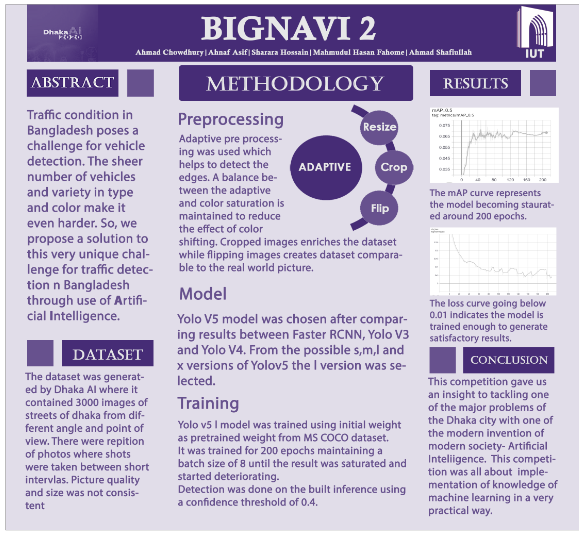
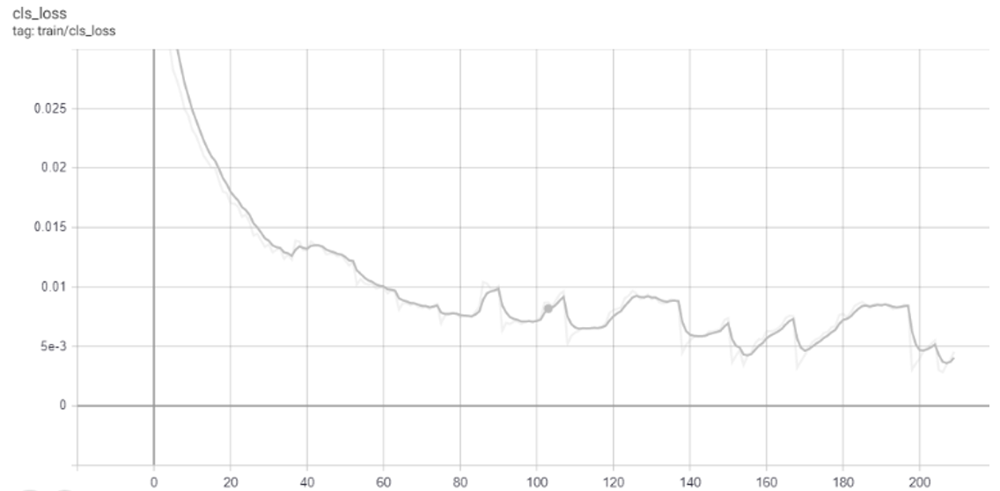
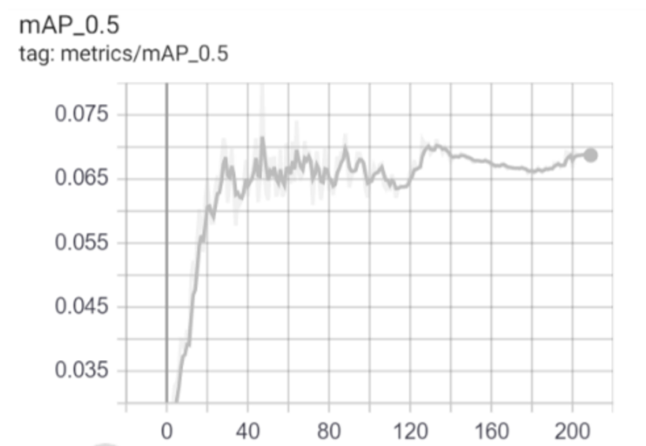
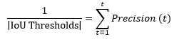
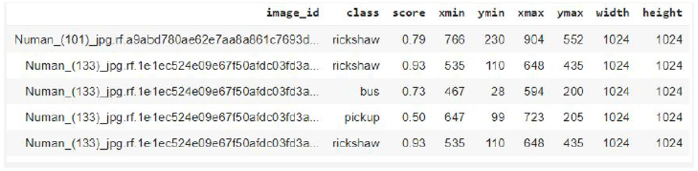
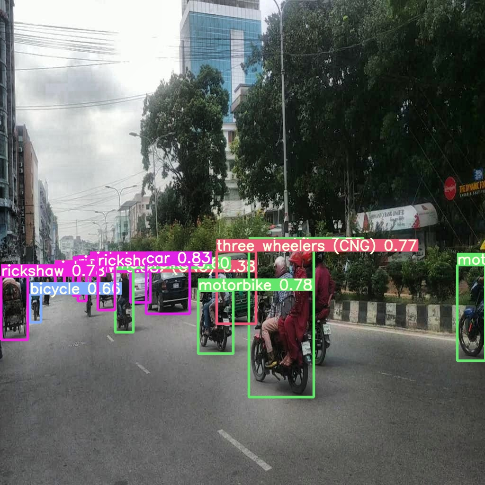
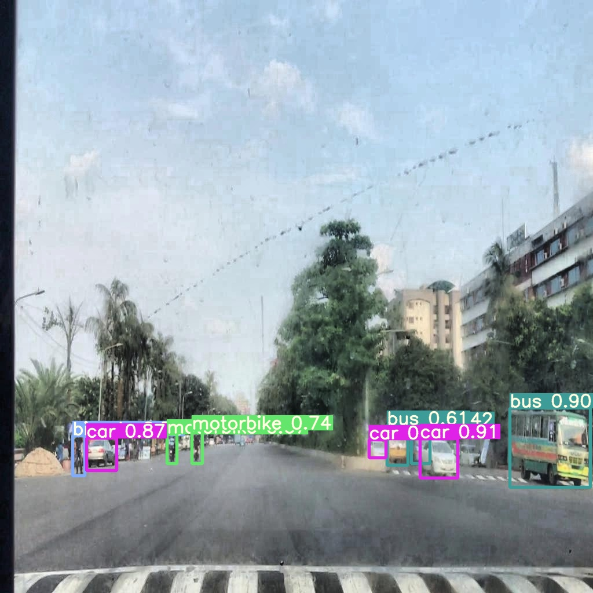
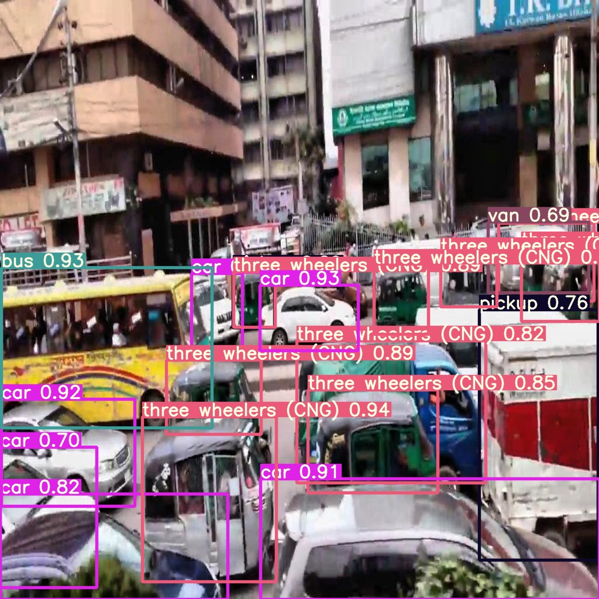
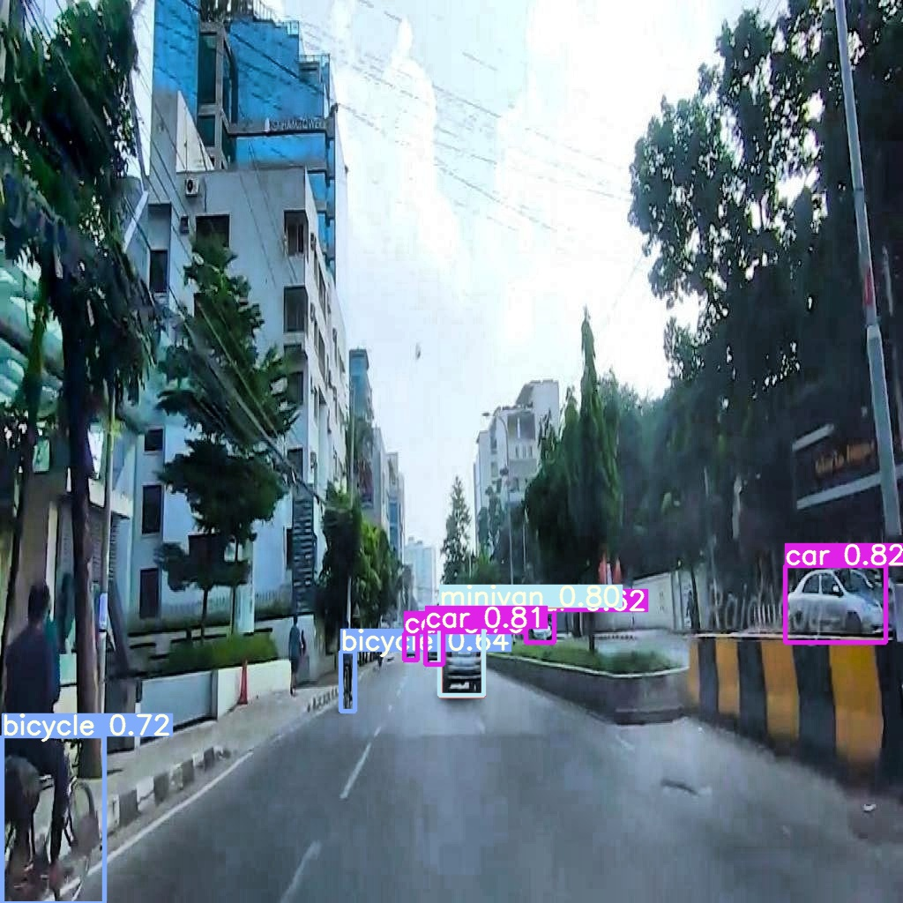

# Multi-Label-Vehicle-detection-based-on-AI
Automatically Detect 21 different labels from Traffic images.

This repository represents object detection methods for 21 different classes of traffic objects. The traffic objects consist of different types of vehicles in the streets of Bangladesh. All course and models are under development and subject to modification and deletion without notice. Representing the mAP and loss curve of this model:

**Accomplishment**: Secured 15th position in Dhaka AI,2020

*Link: https://dhaka-ai.com/leaderboard2*

# Dataset:

*Source: https://dataverse.harvard.edu/dataset.xhtml?persistentId=doi:10.7910/DVN/POREXF*

The dataset was generated by Dhaka AI where it contained 3000 images of streets of Dhaka from different angle and point of view. There were similar photos, where shots were taken between short intervals. Picture quality and size was not consistent. 21 vehicle classes are:
1. Ambulance
2. Army Vehicle
3. Auto rickshaw
4. Bicycle
5. Bus
6. Car
7. Garbage van
8. Human hauler
9. Minibus
10. Minivan
11. Motorbike
12. Pickup
13. Police car
14. Rickshaw
15. Scooter
16. SUV
17. Taxi
18. Three wheelers (CNG)
19. Truck
20. Van
21. Wheelbarrow

# Requirements:

Python 3.7 or later with all requirements.txt dependencies installed.

To install, run:
$ pip install -r requirements.txt

# Tutorial:

•	Python basic (Mandatory)

•	OpenCV 

•	Pytorch

•	Tensor flow

•	Keras

# Environments:

Included code files maybe be run in any of the following verified environments (with all dependencies including cuda, cudnn, python and pytorch pre-installed):

   •	Google Colab and kaggle notebooks with free GPU installed

   •	Google Cloud Deep Learning VM

   •	Amazon Deep Learning AMI

   •	Docker Image

# Preprocessing:

**Data preprocessing:**

   •	**Adaptive:** Used to help detect the edges. A balance between the adaptive and color saturation is maintained to reduce the effect of color shifting. 

   •	**Cropping:** Enriches the dataset. 

   •	**Flipping:** Flipping images creates dataset comparable to the real-world picture.

   •	**Resize:** Required to fit the image for current model.

**File preprocessing:**

1.	Creating  dataframe structure:
	
      •	filename : contains the name of the image

      •	cell_type: denotes the type of the cell
 
      •	xmin: x-coordinate of the bottom left part of the image

      •	xmax: x-coordinate of the top right part of the image
      
      •	ymin: y-coordinate of the bottom left part of the image
 
      •	ymax: y-coordinate of the top right part of the image
 
      •	labels : Encoded cell-type (Yolo - label input-1)

      •	width : width of that bbox

      •	height : height of that bbox

      •	x_center : bbox center (x-axis)

      •	y_center : bbox center (y-axis)

      •	x_center_norm : x_center normalized (0-1) (Yolo - label input-2)

      •	y_center_norm : y_center normalized (0-1) (Yolo - label input-3)

      •	width_norm : width normalized (0-1) (Yolo - label input-4)

      •	height_norm : height normalized (0-1) (Yolo - label input-5)

2.	Data segregation
3.	Splitting into training and validation datasets
4.	Moving to corresponding folder

# Model:

Yolo V5 model was chosen after comparing results between Faster RCNN, Yolo V3 and Yolo V4. From the possible s,m,l and x versions of Yolov5 the l version was selected.

# Hyperparameters:

!python train.py --img 1024 --batch 8 --epochs 200 --data yolov5.yaml --cfg models/yolov5s.yaml

# Training:

Yolo v5 L model was trained using initial weight as pretrained weight from MS COCO dataset. It was trained for 200 epochs maintaining a batch size of 8 until the result was saturated and started deteriorating. Detection was done on the built inference using a confidence threshold of 0.4.

# Testing:

The images are tested by the model after preprocessing.
!python detect_xyxy.py --source '(source location)' --weights '(Trained weight location)'  --save-txt --save-conf --save-dir '(Saving directry location)'

# Evaluation metrics:

**Key attributes**

For this competition, there are 21 classification labels over a diverse set of images. The key
elements for evaluations metrics are:

     ● Classification Labels
   
     ● Confidence
   
     ● Bounding Boxes
     
# Key metrics

The accuracy is evaluated on the mean average precision at a different intersection over union
(IoU) thresholds. The IoU of a set of predicted bounding boxes and ground truth bounding boxes is
calculated as:

                 IoU(A, B) = A⋃B/ A⋂B

The metric sweeps over a range of IoU thresholds, at each point calculating an average
precision value. The threshold values range from 0.5 to 0.75 with a step size of 0.05. In other
words, at a threshold of 0.5, a predicted object is considered a "hit" if its intersection over union
with a ground truth object is greater than 0.5.

At each threshold value t , a precision value is calculated based on the number of true positives (TP),
false negatives (FN), and false positives (FP) resulting from comparing the predicted object to all
ground-truth objects:

              precision(t) = T P (t) / T P (t)+F P (t)+F N(t)

A true positive is counted when a single predicted object matches a ground truth object with an
IoU above the threshold. A false positive indicates a predicted object had no associated ground
truth object. A false negative indicates a ground truth object had no associated predicted object.
The average precision of a single classification label is calculated as the mean of the above
precision values at each IoU threshold: 

In our submission, we were asked to provide classification labels for each bounding box as well as a
confidence score. At first, the class labels are used to match the target labels then bounding boxes
will be evaluated based on the above process. This means that bounding boxes with correct labels
will be checked with target labels and bounding boxes, which determines what boxes are considered
true positives.

# Submission File

The submission format requires a comma delimited set of bounding boxes. For example:
image_id_01, Truck, 0.5,766,230,904,552,1024,1024
indicates that image image_id_01 has a bounding box with a confidence of 0.5, at xmin == 766,
ymin == 230, xmax == 904, ymax == 552, with width and height of 1024 by 1024.
It is important to scale the images to 1024x1024 as all the test images are scaled to 1024.
The file should contain a header and have the following format. Bounding boxes are formatted using
pascal voc.

# Output Sample Images:

                 

